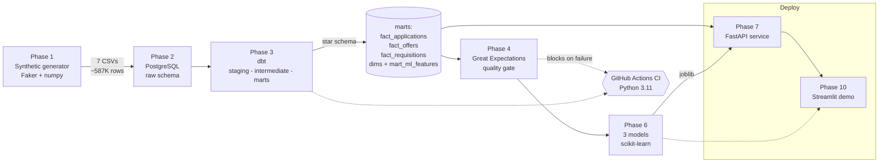

# Recruiting Intelligence Platform

An end-to-end data pipeline that ingests recruiting-funnel data, models it into a
tested data warehouse, trains three leakage-audited risk models, and serves
predictions — each paired with a plain-language recommended action — through a
public API and an interactive demo.

**What it is / who it's for.** This is a portfolio-grade demonstration of the
*full analytics-engineering + ML lifecycle*: synthetic data generation with
embedded, validated signal → PostgreSQL raw layer → dbt star schema with 105
tests → a Great Expectations quality gate that blocks CI → a leakage-safe feature
mart → three trained models → a FastAPI service → a Streamlit demo. It is built
for anyone evaluating how a recruiting funnel can be turned into decision support
(which requisitions will miss their fill target, which candidates will drop out,
which offers will be declined) — and, honestly, as a defensible showcase of the
methodology rather than a plug-and-play product.

> **Bring your own data, not pre-trained weights.** The models here learn *this
> project's synthetic* correlations; they will not transfer to a real company's
> ATS as-is. The portable asset is the **validated pipeline and methodology** —
> you map your ATS export to the documented schema and re-run (retrain) the
> pipeline on your data. See **[docs/BRING_YOUR_OWN_DATA.md](docs/BRING_YOUR_OWN_DATA.md)**.

---

## Live demo

- **Interactive demo (Streamlit):** https://recruiting-intelligence-platform.streamlit.app
- **API + interactive docs (FastAPI / Swagger):** https://recruiting-intel-api.onrender.com/docs

> Both run on free tiers. The API **sleeps when idle**, so the first request may
> take ~30–60s to wake it (the demo shows a spinner) — subsequent calls are fast.
> The deployed instance builds a quarter-scale dataset on first boot to stay
> within free-tier limits; the full-scale, canonical numbers cited below are what
> CI reproduces and the model cards report.

---

## Business questions it answers

1. Which open requisitions are at risk of missing their time-to-fill target?
2. Which in-pipeline candidates are likely to drop out before a decision?
3. Which extended offers are likely to be declined?
4. Which recruiters / sources / stages are the actual bottlenecks? (via the KPI marts)

---

## Architecture



**Layers**

| Phase | What | Tech |
|---|---|---|
| 1 | Synthetic funnel generator with embedded, tunable signal | Python, Faker, numpy, pandas |
| 2 | Raw landing layer (typed, 1:1 with source) | PostgreSQL, `COPY` bulk load |
| 3 | staging → intermediate → **star-schema marts**, 105 tests | dbt (dbt-postgres) |
| 4 | Data-quality gate (referential integrity, ranges, domains) that **blocks CI** | Great Expectations, GitHub Actions |
| 5 | One-row-per-application **feature mart** (leakage-audited) | dbt |
| 6 | Three risk models (baseline vs gradient-boosted, compared) | scikit-learn |
| 7 | Prediction + KPI API with rule-based recommendations | FastAPI |
| 8 | One-command local stack | Docker Compose |
| 9 | Cloud deploy (build-on-first-boot web service + managed Postgres) | Render |
| 10 | Interactive demo | Streamlit |

---

## Key validated findings (canonical full-scale run: 120,000 applications, 10,836 hires, 16,209 offers)

The generator embeds four correlations *by construction*, and they survive
end-to-end into the marts and models. These are measured from the data, not
asserted:

| Signal | Measured gap |
|---|---|
| **Referrals accept offers more** | referral accept ~78% vs non-referral ~63% (~15pp bump) |
| **Below-band offers get declined** | decline rate ~45% when offer < 90% of band midpoint vs ~30% at/above |
| **Long stage stalls precede withdrawal** | drop-off ~16% when a candidate sits >10 days in a stage vs ~8% |
| **Senior + niche-location roles miss their fill target** | miss rate 67.8% (senior+niche) vs 39.5% (others), per-hire grain |

**Model results** (75/25 stratified split; baseline logistic regression vs
HistGradientBoosting, higher test AUC selected; full detail in
[`models/model_cards/`](models/model_cards)):

| Model | Target | Selected | Test AUC | Test F1 | Top driver |
|---|---|---|---|---|---|
| **Time-to-fill risk** | will a req miss its target | HistGradientBoosting | **0.7069** | 0.6091 | `is_niche_location` (by a wide margin) |
| **Candidate drop-off** | will a candidate withdraw | HistGradientBoosting | **0.6713** | 0.2518 | `max_stage_dwell_days` |
| **Offer decline** | will an offer be declined | LogisticRegression | **0.6413** | 0.4988 | `offer_to_band_ratio` |

Each API prediction is returned with a **rule-based recommended action** derived
from the model's own top feature importances (a transparent heuristic, flagged
`is_heuristic`, not a second model) — e.g. a below-band high-decline-risk offer
returns *"Offer is below 90% of band midpoint… consider increasing the offer or
emphasizing non-salary value."*

**Engineering notes worth calling out:**
- **Leakage discipline per model.** The time-to-fill model trains *only* on
  requisition features known when a req opens (it must score still-open reqs);
  the offer model excludes `days_to_respond` (only known after the candidate
  responds). Documented in each model card.
- **Reproducibility is pinned.** The generator's output depends on the numpy
  major version even with a fixed seed, so the canonical environment is Python
  3.11 + `numpy==1.26.4` (Docker/CI). CI regenerates full-scale data on every
  push and **asserts exactly 10,836 hires**, failing loudly on drift. See
  [NOTES.md](NOTES.md).
- **The quality gate really blocks.** Verified by deliberately breaking a test
  and confirming CI failed, then reverting.

---

## Run it locally

One command brings up Postgres, builds the warehouse (generate → load → dbt build
→ train), and serves the API:

```bash
git clone https://github.com/Suryar2710/Recruiting-Intelligence-Platform.git
cd Recruiting-Intelligence-Platform
docker compose up --build
```

Then:
- API docs: http://localhost:8000/docs
- Example: `curl "http://localhost:8000/requisitions/at-risk?limit=5"`

Run the Streamlit demo against the local API:

```bash
API_BASE_URL=http://localhost:8000 streamlit run phase10_streamlit/app.py
```

**Requirements:** Docker + Docker Compose. First boot runs the full pipeline
(a few minutes at full scale); subsequent boots detect the existing warehouse and
start immediately. Set `PIPELINE_SCALE=0.25` in the compose env for a faster demo.

---

## Repository layout

```
phase1_generate_data/   synthetic funnel generator (embedded signal)
phase2_postgres/        docker-compose Postgres + raw loader + schema
phase3_dbt/             staging / intermediate / marts models + tests
phase4_data_quality/    Great Expectations mart validation (CI gate)
phase6_models/          three model-training scripts (leakage-audited)
phase7_api/             FastAPI service + rule-based recommendations
phase10_streamlit/      Streamlit demo (calls the deployed API)
docker/                 entrypoints (local one-shot job; cloud build-then-serve)
models/                 trained *.joblib + model_cards/
docs/                   BRING_YOUR_OWN_DATA.md
.github/workflows/      quality_gate.yml (CI)
render.yaml             one-click Render Blueprint
```

---

## What I'd add with more time

- **Real-data integration.** Wire an actual ATS export (Greenhouse/Lever) through
  the documented schema and re-validate the pipeline on genuine outcomes.
- **A retraining + monitoring loop.** Scheduled retrains, feature/label drift
  detection, and model-performance monitoring rather than one static snapshot.
- **Precision@top-k evaluation.** For a triage tool, "are the top-k flagged reqs
  actually the ones that missed?" matters more than global AUC — add ranked
  evaluation and calibration.
- **A fairness audit framework.** Slice model performance and error rates by
  candidate attributes to check for disparate impact before any real deployment.
- **Survival modeling for time-to-fill.** Model still-open reqs with censoring
  rather than a binary hit/miss on completed fills only.
